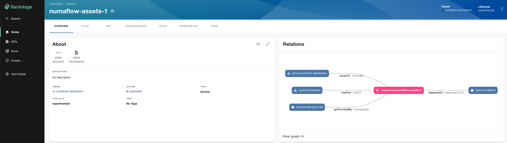
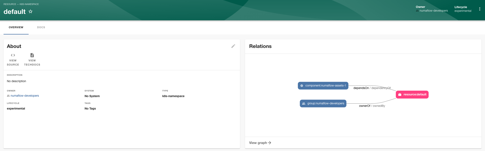

# How to create a custom entity provider
Reference: https://backstage.io/docs/features/software-catalog/external-integrations/

An example [code commit](https://github.com/KeranYang/my-backstage-app/commit/a9bad865696722f7cf60c6a7ddf27bba114faa7d)
to read from my local hosted service and create catalog entities accordingly.

The custom provider retrieves namespace information from the service for a numaflow asset,
creates the namespace entity in backstage catalog and builds the dependency relationship between the asset and namespace.

The provider is configured to run every 5 seconds.

## Step one: start the service
Follow *step one* in [read-from-external](read-from-external.md) to set up the service.

## Step two: verify the entity from the website

The page of numaflow asset.

The page of the namespace entity.

# Reflecting changes from external service
After I updated the namespace of the asset from `default` to `default-1`,
the entity provider was able to create the new namespace entity and updated the dependency graph accordingly.
The old `default` namespace entity was automatically deleted by the catalog, probably because it became an orphan entity.
