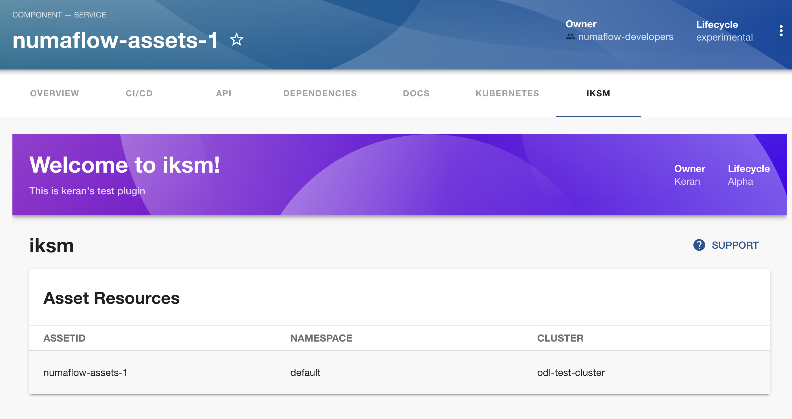

# How to read from an external data source

This document describes how to read from an external data source using a Backstage plugin.

## Step one: create an external data source

I created a simple java application that exposes a REST API to mimic an external data source.
The source code is available at https://github.com/KeranYang/kubernetes-service.

Check out the code and run the application locally:

```bash
mvn clean install
mvn spring-boot:run
```

To verify the application is running, run the following command:

```bash
curl -H "Accept: application/json" http://localhost:7373/getResources/1
```

It should return a json object:

```json
{"assetId":"1","namespaceName":"namespace1","clusterName":"cluster1"}
```

## Step two: create a Backstage plugin to read from the external data source

1. Create a new plugin by following https://backstage.io/docs/plugins/create-a-plugin:

```bash
yarn new --select plugin
```

You will be asked to provide the plugin name. e.g. I name mine `iksm`.

To verify a new plugin is created successfully, access localhost:3000/{plugin-name}. You should see a page with example contents.

2. Configure the plugin to read from the external data source. Update the plugin components to read from the external data source. [**Sample Commit**](https://github.com/KeranYang/my-backstage-app/commit/609d60923735bda6b22c4937d9ec08bbb1cdbf5e)
   The main update is to change the FetchComponent to read from the external data source.

```tsx
try {
      const response = await axios.get(`http://localhost:7373/getResources/numaflow-asset-1`);
        return [response.data];
    } catch (e) {
        throw e;
    }
```

To verify this change, go to one of the service entities, you should be able to see the data from the external data source.

## Step three: fetch data from the external data source based on the entity name

This is to verify the use case where each entity wants to display its own relevant data from the external data source.
I followed the steps in https://backstage.io/docs/plugins/integrating-plugin-into-software-catalog to fetch data from the external data source based on the entity name.

Side Notes from the documentation:

> This is an advanced use case and currently is an experimental feature. Expect API to change over time.

[**Sample Commit**](https://github.com/KeranYang/my-backstage-app/commit/0bcff5a09ed9241bf3ecd10bb942cda32f30a272)

In this commit, the following changes are included:

1. Add a tab to service entity page to display the data from the external data source.
2. Update the fetching logic to fetch data based on the entity name.
3. Update the entity name to match the entity name in the external data source. (numaflow-assets-1)

## Step four, view the data from the external data source on the entity page


